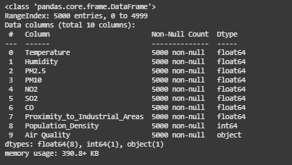
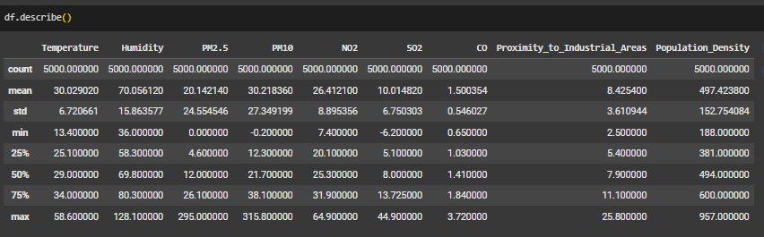
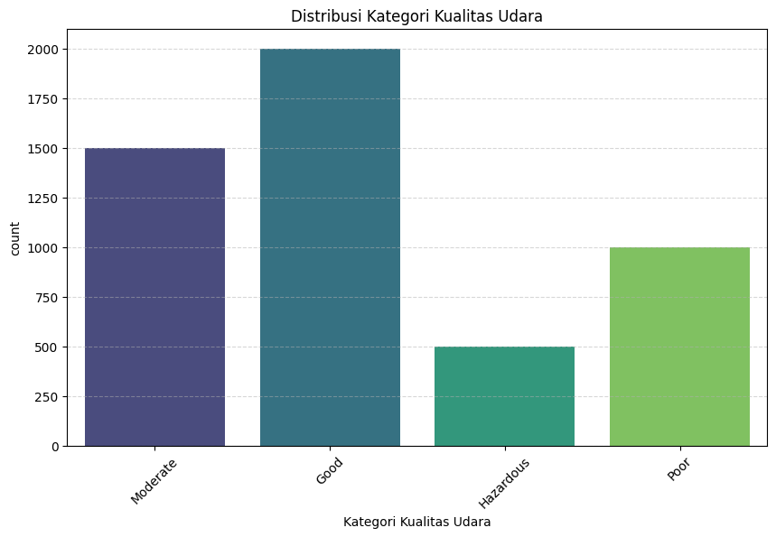
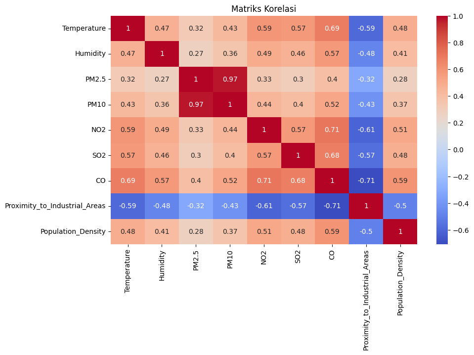
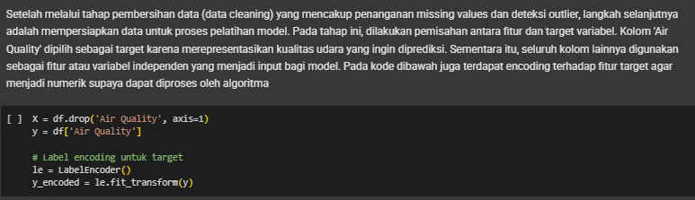
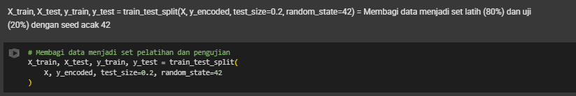

# Laporan Proyek Machine Learning - Muhammad Rozagi

## Domain Proyek: Kesehatan
### Latar Belakang
Kualitas udara menjadi salah satu aspek penting dalam kehidupan masyarakat karena berdampak langsung terhadap kesehatan dan lingkungan. Peningkatan polusi udara akibat emisi industri, kendaraan bermotor, dan aktivitas manusia lainnya telah mendorong perlunya sistem prediksi yang mampu memberikan peringatan dini terhadap penurunan kualitas udara. Salah satu parameter utama yang digunakan untuk mengukur kualitas udara adalah konsentrasi partikel seperti PM2.5, PM10, NO₂, SO₂, dan CO.

Dalam beberapa tahun terakhir, pendekatan berbasis machine learning mulai banyak digunakan untuk memodelkan dan memprediksi kualitas udara. Muhaimin et al. (2023) menunjukkan bahwa metode Gradient Boosting Regression dapat memberikan hasil prediksi yang akurat terhadap konsentrasi PM2.5 di Kota Malang, menjadikannya alternatif yang menjanjikan dibanding metode konvensional. Sementara itu, Karyadi dan Santoso (2022) membandingkan performa model deep learning seperti LSTM, Bidirectional LSTM, dan GRU, dan menemukan bahwa pendekatan LSTM memberikan hasil yang cukup baik dalam memprediksi data time series kualitas udara.

Penggunaan algoritma seperti Random Forest, XGBoost, dan Support Vector Machine (SVM) juga telah banyak diteliti karena kemampuannya dalam menangani data non-linear dan kompleks. Sebagai contoh, Rahmadina et al. (2020) mengkaji klasifikasi kualitas udara di Jakarta menggunakan Random Forest dan membuktikan model tersebut efektif dalam mengklasifikasikan kategori udara secara tepat.

Dengan mempertimbangkan keberhasilan studi-studi sebelumnya, penelitian ini bertujuan membandingkan kinerja model Random Forest, XGBoost, dan SVM dalam memprediksi kategori kualitas udara berbasis data polutan dan lingkungan, sehingga dapat memberikan kontribusi dalam pengambilan keputusan mitigasi pencemaran udara.


### Referensi
Muhaimin, M. R., Karina, D. M., & Krisna, A. B. (2023). _Prediksi Kualitas Udara Malang Menggunakan Metode Gradient Boosting Regression_. Jurnal Digitech, 7(1).[https://jurnal.itscience.org/index.php/digitech/article/view/5046](https://jurnal.itscience.org/index.php/digitech/article/view/5046)

Karyadi, Y., & Santoso, H. (2022). _Prediksi Kualitas Udara Dengan Metoda LSTM, Bidirectional LSTM, dan GRU_. Jurnal JATISI, 9(1). [https://jurnal.mdp.ac.id/index.php/jatisi/article/view/1588](https://jurnal.mdp.ac.id/index.php/jatisi/article/view/1588)

Rahmadina, F., Nugroho, H. A., & Firdaus, A. (2020). _Klasifikasi Kualitas Udara Menggunakan Random Forest. Jurnal RESTI (Rekayasa Sistem dan Teknologi Informasi)_, 4(2), 327-334.[https://ejournal.undip.ac.id/index.php/resti/article/view/27444](https://ejournal.undip.ac.id/index.php/resti/article/view/27444)

## Business Understanding
### Problem Statements
- Bagaimana cara memprediksi kategori kualitas udara (seperti Good, Moderate, Poor) berdasarkan parameter lingkungan seperti suhu, kelembaban, PM2.5, PM10, NO₂, SO₂, CO, kedekatan dengan kawasan industri, dan kepadatan penduduk?
- Algoritma machine learning mana yang paling efektif dalam mengklasifikasikan kualitas udara dari berbagai daerah berdasarkan data polusi dan lingkungan?

### Goals
- Membangun model klasifikasi berbasis machine learning yang mampu memprediksi kategori kualitas udara dengan akurasi tinggi.
- Membandingkan performa berbagai algoritma machine learning seperti Random Forest, XGBoost, dan SVM dalam mengklasifikasikan kualitas udara.

### Solution statements
- Menggunakan beberapa algoritma klasifikasi untuk membangun model prediksi kualitas udara, yaitu:
  - Random Forest Classifier  
  - XGBoost Classifier  
  - Support Vector Machine (SVM)  

- Melakukan serangkaian tahapan preprocessing data seperti:
  - Menghapus data duplikat dan membersihkan data tidak konsisten  
  - Menangani missing value (jika ada)  
  - Encoding label kategori kualitas udara menjadi numerik  
  - Standarisasi fitur numerik menggunakan `StandardScaler`  

- Melatih dan mengevaluasi model menggunakan metrik evaluasi klasifikasi:
  - Accuracy  
  - Recall  
  - F1-score  
  - Confusion Matrix  

- Membandingkan performa antar model untuk menentukan model klasifikasi terbaik berdasarkan metrik evaluasi

- Menguji model terbaik pada data baru untuk melihat generalisasi dan kemampuan prediksi terhadap data di luar pelatihan

- Menginterpretasikan hasil model terhadap klasifikasi kategori kualitas udara

## Data Understanding
Proyek ini menggunakan dataset Air Quality and Pollution Assessment dataset yang dapat diakses melalui Kaggle pada link berikut [Air Quality and Pollution Assessment dataset](https://www.kaggle.com/datasets/mujtabamatin/air-quality-and-pollution-assessment/data).

## 📊 Variabel pada Dataset Prediksi Kualitas Udara

Berikut adalah deskripsi dari masing-masing fitur (variabel) dalam dataset `Air Quality and Pollution Assessment dataset` yang digunakan untuk memprediksi kualitas udara:

| Variabel                       | Deskripsi                                                                                     |
|-------------------------------|-----------------------------------------------------------------------------------------------|
| `Temperature`                 | Suhu udara lingkungan dalam satuan °C. Mempengaruhi reaksi kimia atmosferik dan konsentrasi polutan. |
| `Humidity`                   | Kelembaban relatif dalam persen (%). Berperan dalam pembentukan dan dispersi polutan udara.     |
| `PM2.5`                      | Partikulat halus berukuran ≤2.5 mikrometer. Partikel ini sangat berbahaya karena bisa masuk ke paru-paru dan aliran darah. |
| `PM10`                       | Partikulat kasar berukuran ≤10 mikrometer. Menyebabkan gangguan pernapasan dan iritasi saluran atas. |
| `NO2`                        | Konsentrasi Nitrogen Dioksida. Gas berbahaya dari pembakaran bahan bakar, berkontribusi pada polusi dan gangguan paru. |
| `SO2`                        | Konsentrasi Sulfur Dioksida. Gas beracun dari proses industri dan pembakaran batu bara.         |
| `CO`                         | Konsentrasi Karbon Monoksida. Gas beracun dari pembakaran tidak sempurna yang berbahaya bagi kesehatan. |
| `Proximity_to_Industrial_Areas` | Kedekatan terhadap kawasan industri. Semakin dekat, risiko paparan polutan lebih tinggi.         |
| `Population_Density`         | Kepadatan penduduk di suatu area. Semakin padat, umumnya tingkat polusi meningkat karena aktivitas manusia. |
| `Air_Quality`                | Label target klasifikasi. Kategori kualitas udara seperti: `Good`, `Moderate`, `Poor`, dll.    |

> Dataset ini digunakan untuk melatih model klasifikasi berbasis machine learning dalam memprediksi kategori kualitas udara berdasarkan parameter lingkungan dan polusi udara.


### Exploratory Data Analysis 
1. Informasi dataset
   <br>
   - Ada 5000 baris dalam dataset.
   - Terdapat **10 kolom** fitur:
      1. `Temperature` (float64)
      2. `Humidity` (float64)
      3. `PM2.5` (float64)
      4. `PM10` (float64)
      5. `NO2` (float64)
      6. `SO2` (float64)
      7. `CO` (float64)
      8. `Proximity_to_Industrial_Areas` (float64)
      9. `Population_Density` (float64)
      10. `Air Quality` (object - target variabel)
    - Tidak terdapat nilai kosong (semua kolom memiliki 5000 non-null entries).
2. Deskripsi statistik fitur numerik dataset
   <br>
   <br>Berdasarkan deskripsi statistik, dataset ini memiliki 8 fitur numerik dengan sebaran nilai yang cukup bervariasi. Rata-rata suhu berada di kisaran 30°C, dengan kelembapan sekitar 70%. Konsentrasi PM2.5 dan PM10 menunjukkan nilai maksimum yang cukup tinggi, mengindikasikan potensi outlier. Nilai-nilai untuk gas pencemar seperti NO2, SO2, dan CO juga menunjukkan variasi yang signifikan. Fitur Proximity to Industrial Areas dan Population Density memiliki distribusi yang relatif normal namun tetap menunjukkan rentang nilai yang lebar, menandakan keragaman kondisi lingkungan dalam dataset.

3. Visualisasi Kategori Udara 
<br>
**Penjelasan:**
- Grafik di atas menunjukkan distribusi jumlah data berdasarkan kategori **kualitas udara**. Dari total 5000 data, kategori `Good` mendominasi dengan sekitar **2000** data, diikuti oleh `Moderate` dengan sekitar **1500** data. Kategori `Poor` memiliki sekitar **1000** data, sementara `Hazardous` merupakan kategori dengan jumlah data paling sedikit, yaitu sekitar **500**.

  Distribusi ini menunjukkan bahwa sebagian besar area dalam dataset memiliki kualitas udara yang baik hingga sedang. Namun, masih terdapat sejumlah wilayah dengan kualitas      udara buruk hingga berbahaya, yang bisa menjadi perhatian khusus dalam analisis lebih lanjut.

---
4. Visualisasi Matriks Korelasi
<br>
**Penjelasan:**
Matriks korelasi di atas menunjukkan hubungan linier antar variabel numerik dalam dataset. Nilai korelasi berkisar dari **-1** (korelasi negatif sempurna) hingga **+1** (korelasi positif sempurna). Warna merah menunjukkan korelasi positif yang kuat, sedangkan warna biru menunjukkan korelasi negatif.
- **PM2.5 dan PM10** memiliki korelasi sangat kuat (**0.97**) → Menunjukkan bahwa keduanya sering meningkat bersama, kemungkinan karena berasal dari sumber polusi yang sama.
- **CO** berkorelasi tinggi dengan **NO2** (**0.71**) dan **SO2** (**0.68**) → Ketiganya biasanya dihasilkan dari pembakaran bahan bakar fosil.
- **Proximity_to_Industrial_Areas** memiliki korelasi negatif terhadap sebagian besar polutan seperti:
  - `CO` (-0.71)
  - `NO2` (-0.61)
  - `SO2` (-0.57)
  - Artinya, semakin dekat ke area industri, semakin tinggi tingkat polusinya.
- **Temperature** juga menunjukkan korelasi sedang terhadap beberapa polutan, seperti:
  - `CO` (**0.69**)
  - `NO2` (**0.59**)
  - Mungkin disebabkan oleh kondisi suhu yang memengaruhi konsentrasi gas di udara.
---
## Data Preparation
Setelah melalui tahap pembersihan data (data cleaning) yang mencakup penanganan missing values dan deteksi outlier, langkah selanjutnya adalah mempersiapkan data untuk proses pelatihan model. Pada tahap ini, dilakukan pemisahan antara fitur dan target variabel. Kolom 'Air Quality' dipilih sebagai target karena merepresentasikan kualitas udara yang ingin diprediksi. Sementara itu, seluruh kolom lainnya digunakan sebagai fitur atau variabel independen yang menjadi input bagi model. Pada kode dibawah juga terdapat encoding terhadap fitur target agar menjadi numerik supaya dapat diproses oleh algoritma
Pada bagian ini akan dilakukan 2 tahap persiapan data, yaitu:
1. Encoding Fitur Kategori
   <br>Mengubah data kategorik menjadi numerik agar bisa diproses oleh algoritma machine learning, dalam kasus ini menggunakan Label Encoding. Karena algoritma machine learning pada umumnya hanya dapat memproses data numerik, sehingga untuk memudahkan proses pemodelan, data kategorik harus diencoding.
<br>Pada kasus ini, yang dilakukan encoding adalah label target yaitu "Air Quality", yang memiliki beberapa kelas yaitu Moderate,Good,Hazardous dan Pooor. Dengan menggunakan Label Encoding, setiap kelas tersebut diubah menjadi angka. Yaitu:

Moderate→ 0

Good → 1

Hazardous → 2

Poor → 3

<br>Proses ini penting agar model machine learning dapat mengenali dan mempelajari pola dari target klasifikasi tersebut.
   <br>

2. Train-Test-Split
   <br>Dataset dibagi menjadi data latih (train) dan data uji (test) menggunakan train_test_split dari sklearn dengan rasio 80:20. Hal ini dilakukan untuk memisahkan data pada proses pelatihan dan evaluasi model.
   <br>


## 🧠 Modeling

Tahapan ini bertujuan membangun model machine learning untuk memprediksi kualitas udara berdasarkan fitur lingkungan. Untuk memastikan proses preprocessing dan pelatihan model berjalan secara konsisten, digunakan pipeline dari `scikit-learn`.

---

### 1. 🌲 Random Forest
```python
from sklearn.pipeline import Pipeline
from sklearn.preprocessing import StandardScaler
from sklearn.ensemble import RandomForestClassifier

rf_pipeline = Pipeline([
    ('scaler', StandardScaler()),
    ('rf', RandomForestClassifier(random_state=42))
])
```
- Tahapan:
  - Membuat pipeline dengan standardisasi dan model Random Forest.
  - Melatih model menggunakan data yang telah distandarisasi.
- Parameter:
  - `random_state=42`: Menetapkan seed agar hasil replikasi konsisten
- Penjelasan Cara Kerja Random Forest:
  - Random Forest adalah algoritma machine learning yang termasuk ke dalam metode ensemble learning, khususnya teknik bagging (Bootstrap Aggregating). Algoritma ini membangun banyak pohon keputusan (decision trees) pada berbagai subset data pelatihan dan menggabungkan hasilnya (melalui voting untuk klasifikasi) untuk meningkatkan akurasi dan mengurangi overfitting.
  - Decision Tree: Masing-masing pohon keputusan dalam Random Forest belajar dari subset data yang diambil secara acak dan melakukan prediksi secara independen.
  - Bagging: Teknik ini mengambil sampel data secara acak dengan pengembalian (bootstrap), melatih banyak model, dan menggabungkan prediksi mereka untuk menghasilkan hasil yang lebih stabil dan akurat.
  - Ensemble: Dengan menggabungkan banyak model lemah (weak learners), Random Forest menghasilkan model yang kuat (strong learner).
  - Random Forest sangat efektif untuk dataset dengan banyak fitur dan cocok digunakan ketika ada kemungkinan overfitting pada pohon keputusan tunggal.
2. ⚡ XGBoost
```python
xgb_pipeline = Pipeline([
    ('scaler', StandardScaler()),
    ('xgb', XGBClassifier(
        n_estimators=600,
        max_depth=15,
        learning_rate=0.1,
        subsample=0.8,
        colsample_bytree=0.8,
        use_label_encoder=False,
        eval_metric='mlogloss',
        random_state=42
    ))
])
)
```
- Tahapan:
  - Membuat pipeline dengan standardisasi dan model XGBoost.
  - Menentukan konfigurasi boosting yang optimal.
  - Melatih model pada data latih.
- Parameter:
  - `n_estimators=600`: Jumlah pohon (trees) yang digunakan.
  - `max_depth=15`: Kedalaman maksimum setiap pohon.
  - `learning_rate=0.1`: Kecepatan pembelajaran dalam proses boosting.
  - `subsample=0.8`: Persentase data yang digunakan untuk setiap pohon.
  - `colsample_bytree=0.8`: Persentase fitur yang digunakan untuk setiap pohon.
  - `use_label_encoder=False`: Menonaktifkan encoder label bawaan XGBoost.
  - `eval_metric='mlogloss'`: Menggunakan log loss sebagai metrik evaluasi.
  - `random_state=42`: Untuk hasil pelatihan yang konsisten.
- Penjelasan Cara Kerja XGBoost:
  - XGBoost (Extreme Gradient Boosting) adalah algoritma machine learning berbasis *boosting* yang efisien dan powerful, dirancang untuk meningkatkan performa dan kecepatan dibandingkan Gradient Boosting tradisional. Berikut adalah cara kerja dan fitur utama XGBoost:
  - Gradient Boosting: 
    - Membangun model secara bertahap.
    - Setiap model baru memperbaiki kesalahan (*error*) dari model sebelumnya.
    - Meminimalkan *loss function* menggunakan pendekatan gradien.
  - Ensemble Learning: 
    - Membentuk banyak pohon keputusan (*decision trees*) secara berurutan.
    - Setiap pohon fokus mengoreksi kesalahan pohon sebelumnya untuk meningkatkan akurasi.
  - Regularisasi: 
    - Menggunakan regularisasi L1 dan L2 untuk mengurangi *overfitting*.
    - Membantu model lebih general dan stabil.
  - Optimasi dan Paralelisasi: 
    - Mendukung pemrosesan paralel saat membangun pohon untuk kecepatan tinggi.
    - Menyediakan optimasi seperti *pruning* pohon otomatis dan pengelolaan memori efisien.

XGBoost menjadi pilihan utama dalam kompetisi data science karena akurasi tinggi dan fleksibilitasnya dalam menangani berbagai jenis data.
3.💠 Support Vector Machine (SVM)
```python
from sklearn.pipeline import Pipeline
from sklearn.preprocessing import StandardScaler
from sklearn.svm import SVC

svm_pipeline = Pipeline([
    ('scaler', StandardScaler()),
    ('svm', SVC(kernel='rbf', C=1.0, gamma='scale', probability=True))
])
```
- Tahapan:
  - Membuat pipeline yang mencakup standardisasi dan SVM.
  - Melatih model untuk menemukan hyperplane terbaik dalam memisahkan kelas.
- Parameter:
  - `kernel='rbf'`: Menggunakan fungsi kernel radial basis function.
  - `C=1.0`: Parameter regulasi; semakin besar nilainya, semakin sedikit toleransi terhadap kesalahan.
  - `gamma='scale'`: Skala otomatis berdasarkan jumlah fitur.
  - `probability=True`: Mengaktifkan estimasi probabilitas kelas.
- Penjelasan Cara Kerja Support Vector Machine:
  - Random Forest adalah algoritma machine learning yang termasuk ke dalam metode ensemble learning, khususnya teknik bagging (Bootstrap Aggregating). Algoritma ini membangun banyak pohon keputusan (decision trees) pada berbagai subset data pelatihan dan menggabungkan hasilnya (melalui voting untuk klasifikasi) untuk meningkatkan akurasi dan mengurangi overfitting.
  - Hyperplane: Merupakan batas pemisah antara dua kelas. Tujuan SVM adalah menemukan hyperplane dengan margin maksimum, yaitu jarak terjauh dari hyperplane ke titik data   terdekat dari masing-masing kelas (support vectors).
  - Margin: Semakin besar margin, semakin baik generalisasi model terhadap data baru.
  - Kernel Trick: Ketika data tidak bisa dipisahkan secara linear, SVM menggunakan fungsi kernel seperti RBF (Radial Basis Function) untuk memetakan data ke dimensi yang lebih tinggi agar bisa dipisahkan secara linear di sana.
  - Support Vectors: Titik-titik data yang paling dekat dengan hyperplane. Titik-titik ini sangat berpengaruh dalam menentukan posisi dan orientasi hyperplane.

## 🔍 Analisis dan Pemilihan Model Terbaik

### ✅ Kelebihan dan Kekurangan Setiap Model

#### 1. Random Forest
**Kelebihan:**
- Mampu menangani data dengan banyak fitur dan kompleksitas tinggi.
- Robust terhadap overfitting karena menggunakan metode ensemble.
- Tidak memerlukan scaling data secara ketat.

**Kekurangan:**
- Model cenderung lambat saat melakukan prediksi jika jumlah pohon sangat besar.
- Interpretasi model lebih sulit dibanding model linear seperti SVM.

#### 2. XGBoost
**Kelebihan:**
- Performa sangat baik untuk berbagai jenis data dan kompetisi ML.
- Memiliki fitur regularisasi sehingga mengurangi risiko overfitting.
- Mendukung paralelisasi saat training (lebih cepat dibanding Random Forest untuk data besar).

**Kekurangan:**
- Lebih kompleks dan membutuhkan tuning parameter yang lebih cermat.
- Waktu training bisa meningkat seiring bertambahnya parameter.

#### 3. Support Vector Machine (SVM)
**Kelebihan:**
- Sangat efektif pada data dengan dimensi tinggi.
- Cocok untuk klasifikasi yang jelas dan tegas antara kelas.
- Menghasilkan margin pemisah yang optimal.

**Kekurangan:**
- Kurang efisien untuk dataset besar (training lambat).
- Sensitif terhadap pemilihan parameter kernel dan skala fitur.

---

## Evaluation
**Metrik yang Digunakan**
1. Accuracy, yaitu persentase prediksi yang benar terhadap seluruh data.
   <br>Formula:
   
   $$
     \text{Accuracy} = \frac{TP + TN}{TP + TN + FP + FN}
   $$
   
   <br>Keterangan:
   - TP = True Positive (Data positif yang diprediksi benar sebagai positif)
   - TN = True Negative (Data negatif yang diprediksi benar sebagai negatif)
   - FP = False Positive (Data negatif yang salah diprediksi sebagai positif)
   - FN = False Negative (Data positif yang salah diprediksi sebagai negatif)

2. Precision, yaitu proporsi data yang diprediksi positif yang benar-benar positif. Metrik ini cocok digunakan saat false positive harus diminimalkan.
   <br>Formula:<br>
   
$$
  \text{Precision} = \frac{TP}{TP + FP}
$$
   
3. Recall (Sensitivity), yaitu roporsi data positif yang berhasil dikenali model. Penting jika false negative berisiko tinggi, seperti pada kasus deteksi penyakit.
   <br>Formula:<br>
   
$$
  \text{Recall} = \frac{TP}{TP + FN}
$$

4. F1-Score, yaitu harmonic mean dari Precision dan Recall. Digunakan saat perlu keseimbangan antara Precision dan Recall.

   <br>Formula:<br>
   
$$
  \text{F1 Score} = 2 \times  \frac{\text{Precision} \times  \text{Recall}}{\text{Precision} + \text{Recall}}
$$

5. ROC-AUC (Receiver Operating Characteristic - Area Under Curve), yaitu luas area di bawah kurva ROC, yang menggambarkan trade-off antara True Positive Rate (TPR) dan False Positive Rate (FPR).
   - Nilai maksimal adalah 1 (semakin mendekati 1 semakin baik).
   - Tidak bergantung pada threshold tertentu.
  

Metrik-metrik ini dipilih karena sesuai dengan konteks permasalahan klasifikasi multi-kelas. Akurasi digunakan untuk melihat secara umum seberapa banyak prediksi model yang benar dibandingkan dengan jumlah data keseluruhan. Namun, karena dalam data terdapat kemungkinan ketidakseimbangan antar kelas, maka precision dan recall digunakan untuk memberikan penilaian yang lebih rinci per kelas. Precision mengukur seberapa tepat model dalam memberikan label suatu kategori, sementara recall menunjukkan seberapa baik model dalam menangkap semua data yang memang termasuk dalam kategori tersebut. F1-score kemudian digunakan sebagai keseimbangan antara precision dan recall, khususnya berguna saat kita ingin menghindari ketimpangan antara keduanya.
  
### 🔍 Evaluasi Akhir dan Pemilihan Model Terbaik

Pada tahapan evaluasi, **model XGBoost** dipilih sebagai **model terbaik** karena menunjukkan performa paling tinggi dalam memprediksi kualitas udara berdasarkan seluruh metrik evaluasi utama. Model ini memperoleh:

- **Accuracy**: 0.961  
- **Precision**: 0.9615  
- **Recall**: 0.961  
- **F1-score**: 0.9611  
- **ROC-AUC**: 0.9966  

Hasil ini menunjukkan bahwa XGBoost mampu mengklasifikasikan kualitas udara dengan sangat baik di semua kelas, termasuk kelas minoritas, dan menunjukkan **keseimbangan optimal antara precision dan recall**. Model ini menjawab **Problem Statement 1** dan **Goal 1**, yaitu menyediakan solusi berbasis machine learning yang akurat dan andal dalam memprediksi kategori kualitas udara (*Good*, *Moderate*, *Poor*, dll.) berdasarkan parameter lingkungan seperti polutan (PM2.5, PM10, NO₂, SO₂, CO), suhu, dan kelembaban.

Selain itu, model ini dibandingkan dengan dua algoritma lain sesuai dengan **Problem Statement 2** dan **Goal 2**, yakni **Random Forest** dan **SVM**. Hasil evaluasi menunjukkan:

| **Metrik**    | **Random Forest** | **XGBoost** | **SVM**  |
| ------------- | ----------------- | ----------- | -------- |
| Accuracy      | 0.960             | 0.961       | 0.942    |
| Precision     | 0.9601            | 0.9615      | 0.9424   |
| Recall        | 0.960             | 0.961       | 0.942    |
| F1-score      | 0.9600            | 0.9611      | 0.9419   |
| ROC-AUC       | 0.9967            | 0.9966      | 0.9952   |

Meskipun perbedaan performa dengan Random Forest sangat tipis, **XGBoost** dipilih karena:

- Konsisten memberikan metrik tertinggi di semua aspek evaluasi.
- Memiliki kemampuan generalisasi yang sangat baik dan efisiensi dalam menangani kompleksitas data.
- Memberikan fitur regularisasi yang mengurangi risiko overfitting.

Hal ini menjawab **Solution Statement** dengan memberikan wawasan penting kepada pengambil kebijakan mengenai sumber polusi yang paling signifikan, sehingga dapat menjadi dasar dalam menetapkan prioritas pengendalian emisi.

### ✅ Kesimpulan

Model **XGBoost** terbukti paling efektif untuk tugas klasifikasi kualitas udara karena:

- Akurasi tinggi dan kinerja seimbang di semua kelas.
- Mendukung kebutuhan lembaga lingkungan dan masyarakat umum untuk memahami informasi kualitas udara secara akurat dan mudah.
- Memberikan hasil evaluasi terbaik tanpa kompromi pada performa atau generalisasi.

Model ini menjawab seluruh aspek dari **Problem Statements**, **Goals**, dan **Solution Statements** proyek ini secara komprehensif.

Kesimpulan akhir:  
**XGBoost** adalah pilihan paling tepat sebagai model terbaik, karena memberikan keseimbangan performa terbaik dan hasil evaluasi yang unggul secara umum. Pemilihan metrik seperti F1-score dan ROC-AUC yang lebih representatif daripada sekadar akurasi sangat penting dalam konteks ini, terutama jika data tidak seimbang atau konsekuensi kesalahan klasifikasi berbeda antara kelas.


